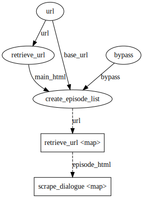
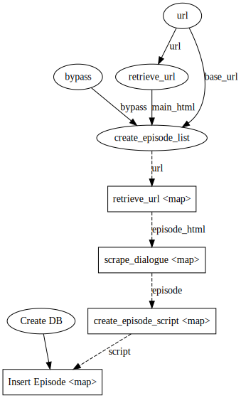

> 
> 涵盖的话题：映射task，并行化，Prefect参数，**flow.run()**关键字参数
> 

在这里，我们将深入研究Prefect提供的一些更高级的功能。在此过程中，我们将构建一个现实世界业务场景的工作流，重点介绍Prefect是如何有利于本地开发的强大工具，从而使我们能够富有表现力地高效创建，检查和扩展自定义数据工作流。

> 
> **例子目标**
> 
> 受电视节目《The X-Files》的复兴以及自然语言处理技术的最新发展的启发，我们寻求从互联网上抓取每个X-Files片段的笔录，并将其保存到数据库中，以便我们基于Dana Scully的角色创建聊天机器人（实际上，创建聊天机器人是留给读者的练习）。
> 
> 所有代码示例均在交互式Python或IPython会话中的本地计算机上执行。
> 

## 概览

我们将分阶段进行，逐步介绍Prefect功能：

 1. 首先，我们将抓取特定的情节以测试抓取逻辑；这仅需要核心的Prefect构建模块
 2. 接下来，我们将汇总所有情节的列表，然后抓取每个情节； 为此，我们将介绍映射task如何在每个情节中有效地重复使用抓取逻辑
 3. 为了加快处理时间，我们将重新执行flow以利用映射task的继承并行性。为此，我们需要使用新的Prefect执行器。我们还将保存此运行的结果，以防止在进一步扩展flow时重新运行抓取作业
 4. 最后，我们想利用Prefect task库创建一个sqlite数据库并将所有数据存储在其中

在我们前进的过程中，我们希望确保flow在将来可重现和可重复使用。

> 
> **BeautifulSoup4**
> 
> 为了轻松浏览网页，我们将使用软件包BeautifulSoup4，这不是Prefect所必需的。要安装BeautifulSoup4，请运行以下任一方法：
> 
> ````bash
> pip install beautifulsoup4 # OR
> conda install beautifulsoup4
> ````
> 

## 设置单个剧集的flow

对我们来说幸运的是，在过去的20年中，《The X-Files》保留了精选的X档案情节成绩单清单。 此外，该网页仍然使用1990年代的基本HTML编写，这意味着抓取非常容易！

以此作为抓取来源，让我们抓取一集《The X-Files》，从“Jose Chung's From Outer Space”开始（由Alex Trebek客串）。

我们首先设置两个Prefect task：

 - **resolve_url**：将原始HTML提取到本地计算机的task
 - **scrape_dialogue**：一项task，该task接受该HTML，并对其按字符提取相关对话进行处理

为了简化操作，让我们导入所需的所有内容并创建**retrieve_url** task：

````Python
import requests
from bs4 import BeautifulSoup
from prefect import task, Flow, Parameter


@task(tags=["web"])
def retrieve_url(url):
    """
    Given a URL (string), retrieves html and
    returns the html as a string.
    """

    html = requests.get(url)
    if html.ok:
        return html.text
    else:
        raise ValueError("{} could not be retrieved.".format(url))
````

注意我们已经用“web”标记了**retrieve_url** task（任何字符串都可以作为标记提供）。

接下来，我们创建**scrape_dialogue** task，该task将包含用于解析原始HTML并仅提取剧集名称和对话（表示为元组[(character, text)]列表）的逻辑。因此task不需要访问网络，所以我们不需要对其进行标记：

````Python
@task
def scrape_dialogue(episode_html):
    """
    Given a string of html representing an episode page,
    returns a tuple of (title, [(character, text)]) of the
    dialogue from that episode
    """

    episode = BeautifulSoup(episode_html, 'html.parser')

    title = episode.title.text.rstrip(' *').replace("'", "''")
    convos = episode.find_all('b') or episode.find_all('span', {'class': 'char'})
    dialogue = []
    for item in convos:
        who = item.text.rstrip(': ').rstrip(' *').replace("'", "''")
        what = str(item.next_sibling).rstrip(' *').replace("'", "''")
        dialogue.append((who, what))
    return (title, dialogue)
````

现在我们有了task，剩下的就是将它们放在一起形成flow。因为我们想将这些task重新用于其他情节，所以我们将URL保留为应在运行时提供的Prefect参数，前提是已经熟悉构造Prefect flow和使用Prefect参数的基础知识。

````Python
with Flow("xfiles") as flow:
    url = Parameter("url")
    episode = retrieve_url(url)
    dialogue = scrape_dialogue(episode)

flow.visualize()
````


太棒了！我们已经构建了flow，一切看起来都很好；剩下的就是运行它。当我们调用**flow.run()**时，我们需要提供两个关键字参数：

 - **parameters**：所需参数值的字典（在我们的示例中为url）

然后，我们打印该集电视的前五个对话语句。

````Python
episode_url = "http://www.insidethex.co.uk/transcrp/scrp320.htm"
outer_space = flow.run(parameters={"url": episode_url})

state = outer_space.result[dialogue] # the `State` object for the dialogue task
first_five_spoken_lines = state.result[1][:5] # state.result is a tuple (episode_name, [dialogue])
print(''.join([f'{speaker}: {words}' for speaker, words in first_five_spoken_lines]))
````

````bash
ROKY CRIKENSON:  Yeah, this is Roky. I checked all the connections. I
don''t know why all the power''s down out here. I''m going to have to come
in and get some more equipment. Yeah, yeah... yeah, I''ll need several of
those. All right...

HAROLD LAMB:  Um... I don''t want to scare you, but... I think I''m madly
in love with you.

CHRISSY GIORGIO:  Harold, I like you a lot too, but this is our first
date. I mean, I think that we need more time to get to know one another.

HAROLD LAMB:  Oh my God... oh my God...

CHRISSY GIORGIO:  Harold, what are those things?
````

感兴趣吗？大！我们可以根据实际网站进行检查，看起来我们的抓取逻辑是正确的。让我们扩大规模并抓取一切。

## 扩展到所有剧集

Now that we're reasonably confident in our scraping logic, we want to reproduce the above example for every episode while maintaining backwards compatibility for a single page. To do so, we need to compile a list of the URLs for every episode, and then proceed to scrape each one.

We achieve this with a single new task:

既然对抓取逻辑有足够的信心，我们想为每个情节重现以上抓取步骤示例，同时保持单个页面的向后兼容性。为此，我们需要为所有情节产生一个URL列表，然后传递给下游task继续抓取每个情节。

我们通过一项新task来实现这一目标：

````Python
@task
def create_episode_list(base_url, main_html, bypass):
    """
    Given the main page html, creates a list of episode URLs
    """

    if bypass:
        return [base_url]

    main_page = BeautifulSoup(main_html, 'html.parser')

    episodes = []
    for link in main_page.find_all('a'):
        url = link.get('href')
        if 'transcrp/scrp' in (url or ''):
            episodes.append(base_url + url)

    return episodes
````

 - **create_episode_list**：给定主页的原始html，创建一个包含所有情节成绩单的绝对URL的列表，并返回该列表。 如果将**bypass**标志设置为True，则返回**base_url**的单个元素列表。这样就可以使用此flow在将来抓取单个剧集。

````Python
@task
def create_episode_list(base_url, main_html, bypass):
    """
    Given the main page html, creates a list of episode URLs
    """

    if bypass:
        return [base_url]

    main_page = BeautifulSoup(main_html, 'html.parser')

    episodes = []
    for link in main_page.find_all('a'):
        url = link.get('href')
        if 'transcrp/scrp' in (url or ''):
            episodes.append(base_url + url)

    return episodes
````

既然我们拥有了用于抓取所有内容的所有构建模块，仍然存在的问题：我们如何将它们放在一起？ 如果没有Prefect，则可以考虑编写循环遍历**create_episode_list**结果。对于每个情节，您可以将所有内容放在**try/except**块中，以捕获任何错误并让其他情节抓取继续进行。 如果你随后想要利用并行性，则需要考虑到还不知道**create_episode_list**将返回多少集，因此需要进一步重构。

这些想法中的任何一个都能起作用，但是请考虑一下：我们已经编写了要执行的代码；其他一切都是额外的样板，以避免可能出现的各种error和负面结果。这正是Prefect如此有用的地方，如果我们将函数组合在一起形成一个flow，那么一切都会得到照顾，并且我们的代码意图仍然显而易见，而不必在防御逻辑费神。

In our current situation, instead of a loop, we utilize the map() method of tasks. At a high level, at runtime task.map(iterable_task) is roughly equivalent to:

在当前情况下，我们使用task的**map()**方法而不是循环。在较高级别，运行时task.map（iterable_task）大致等效于：

````Python
results = iterable_task.run()

for item in results:
    task.run(item)
````

Prefect将为结果的每个元素动态创建一个task，而无需知道结果元素总数的固定值。

现在，我们开始实际构造flow；你会注意到创建的第一个flow中的其他几行：

 - **bypass**参数，允许我们绕过抓取主页获取所有剧集的列表。
 - 在这种情况下，我们将对主页以及所有情节页面使用**retrieve_url** task（能够通过新参数重用函数是函数式工作流工具的一大优势）
 - 如上所述，现在将使用**.map()**调用**retrieve_url**和**scrape_dialogue**

````Python
with Flow("xfiles") as flow:
    url = Parameter("url")
    bypass = Parameter("bypass", default=False, required=False)
    home_page = retrieve_url(url)
    episodes = create_episode_list(url, home_page, bypass=bypass)
    episode = retrieve_url.map(episodes)
    dialogue = scrape_dialogue.map(episode)
````

> 
> **Prefect参数基类**
> 
> 在上面的示例中，Parameter类具有一些有用的设置：
> 
> - **default**：参数应采用默认值。在我们的例子中，我们需要**bypass=False**
> - **required**：一个布尔值指定在flow运行时是否需要该参数；如果未提供，将使用默认值
> 

为了突出显示map的好处，注意我们通过编写一个新函数并以最小的更改重新编译flow，就能达到从抓取一个情节到抓取所有情节的目的：我们的原始flow有三个task，而新flow则有数百个！

````Python
flow.visualize()
````



> 
> 如何返回映射的task
> 
> 在flow运行中，**flow_state.result**[task]返回task的运行后状态（例如，Success表示task运行成功）。如果task是调用**.map()**的结果，则**flow_state.result**[task]将是一种特殊的状态，称为**Mapped**状态。此**Mapped**状态具有两个值得说一说的特殊属性：
> 
>  - **map_states**：此属性包含所有单个映射实例运行后的状态的列表
>  - **result**：映射task的结果是所有映射实例运行后的结果的列表
> 

现在，让我们运行flow，对其执行时间计时，并打印前五个抓取情节的状态：

````Python
%%time
scraped_state = flow.run(parameters={"url": "http://www.insidethex.co.uk/"})
#    CPU times: user 7.48 s, sys: 241 ms, total: 7.73 s
#    Wall time: 4min 46s

dialogue_state = scraped_state.result[dialogue] # list of State objects
print('\n'.join([f'{s.result[0]}: {s}' for s in dialogue_state.map_states[:5]]))
````

````bash
BABYLON - 1AYW04: Success("Task run succeeded.")
Pilot - 1X79: Success("Task run succeeded.")
Deep Throat - 1X01: Success("Task run succeeded.")
Squeeze - 1X02: Success("Task run succeeded.")
Conduit - 1X03: Success("Task run succeeded.")
````

很棒，5分钟还算不错！一个精明的读者可能会注意到每个映射的task都是令人尴尬的并行。在本地运行时，Prefect将默认为同步执行（使用Synchronous executor），因此在执行过程中未充分利用此属性的并行目的。

为了允许并行执行task，不需要重新编译flow，我们提供了一个执行器，可以在运行调用中处理并行性。在本地情况下，Prefect提供了**DaskExecutor**用于执行并行流。这些执行管道可以生成新进程**local_processes=True**，也可以仅使用线程。在下面的示例中，我们选择使用**local_processes=True**。

> 
> **执行器是什么？**
> 
> Prefect执行器是计算的核心驱动程序，执行器指定flow中每个task的运行方式和位置。
> 

一个执行器有关的限制。

> 
> 文件描述符的系统限制
> 
> 在本地使用并行机制会在计算机上打开大量的文件描述符，并偶尔导致隐藏错误，应检查文件描述符的系统限制，并在必要时增加它。
> 
> 如果要遵循并在本地执行代码，建议使用交互式Python或IPython会话进行，因为DaskExecutor将产生新的子进程，所以如果脚本执行不正确，则会出现问题。
> 

````Python
from prefect.engine.executors import DaskExecutor

executor = DaskExecutor(local_processes=True)

%%time
scraped_state = flow.run(parameters={"url": "http://www.insidethex.co.uk/"},
                         executor=executor)

#    CPU times: user 9.7 s, sys: 1.67 s, total: 11.4 s
#    Wall time: 1min 34s

dialogue_state = scraped_state.result[dialogue] # list of State objects
print('\n'.join([f'{s.result[0]}: {s}' for s in dialogue_state.map_states[:5]]))
````

````bash
BABYLON - 1AYW04: Success("Task run succeeded.")
Pilot - 1X79: Success("Task run succeeded.")
Deep Throat - 1X01: Success("Task run succeeded.")
Squeeze - 1X02: Success("Task run succeeded.")
Conduit - 1X03: Success("Task run succeeded.")
````

太棒了，我们几乎毫不费力地极大地提高了我们的执行速度！

## 扩展flow写入数据库

现在我们已经成功抓取了所有对话，下一步自然是将其存储在数据库中以进行查询。 为了确保整个工作流在将来仍可重现，我们希望使用新task扩展当前flow（而不是从头开始创建新流程）。 此外，我们将从Prefect的task库中提取针对sqlite数据库执行SQL脚本的常见task。

为此，我们首先创建三个新task：

 - **create_db**：使用内置的Prefect SQLiteQuery创建一个新的“XFILES”表
 - **create_episode_script**：抓取剧集并创建一个sqlite脚本，用于将数据插入数据库
 - **insert_episode**：执行创建的脚本，并使用内置的Prefect SQLiteQuery将对话框插入“XFILES”表中

````Python
from prefect.tasks.database import SQLiteScript

create_db = SQLiteScript(name="Create DB",
                             db="xfiles_db.sqlite",
                             script="CREATE TABLE IF NOT EXISTS XFILES (EPISODE TEXT, CHARACTER TEXT, TEXT TEXT)",
                             tags=["db"])

@task
def create_episode_script(episode):
    title, dialogue = episode
    insert_cmd = "INSERT INTO XFILES (EPISODE, CHARACTER, TEXT) VALUES\n"
    values = ',\n'.join(["('{0}', '{1}', '{2}')".format(title, *row) for row in dialogue]) + ";"
    return insert_cmd + values

insert_episode = SQLiteScript(name="Insert Episode",
                                  db="xfiles_db.sqlite",
                                  tags=["db"])
````

注意对于**create_db**，我们在初始化时提供脚本，而对于**insert_episode** task，我们在运行时提供脚本。 Prefect的task通常支持两种模式，以允许在初始化时自定义默认值，或者可以选择在运行时动态覆盖默认值。

为了扩展flow，我们可以使用当前flow打开一个上下文管理器并添加与正常task一样的task。注意我们利用了一个事实：对话是当前会话中定义的task。

````Python
from prefect import unmapped

with flow:
    db = create_db()
    ep_script = create_episode_script.map(episode=dialogue)
    final = insert_episode.map(ep_script, upstream_tasks=[unmapped(db)])
````

> 
> **task.map()**
> 
> 在上面的示例中，我们为**task.map()**使用了新的调用签名。通常情况下，不应将task的某些参数做映射（它们保持静态）。 可以使用特殊的未映射变量容器来维护变量，该容器包装的无映射参数可以在映射task中使用。在上面的示例中，参数“ db”没有映射，而是按原样提供给**insert_episode**。
> 
> 你可能还会注意到特殊的**upstream_tasks**关键字参数。这在映射中不是必须的，并且是一种函数式的指定不传递任何数据的上游依赖的方法。
> 

````Python
flow.visualize()
````



现在我们准备执行flow！当然，我们已经取消了所有对话，并不需要真正重做所有工作。这是我们先前的flow状态（scraped_state）派上用场的地方！回想一下**scraped_state.result**将是task到其相应状态的字典。因此，我们可以通过**task_states**关键字参数将这些信息提供给下一个flow运行实例。然后将使用这些状态来确定是否应运行每个task或它们是否已经完成。 因为我们已经向flow中添加了新task，所以新task在此字典中将没有相应的状态，并且将按预期运行。

````Python
state = flow.run(parameters={"url": "http://www.insidethex.co.uk/"},
                 executor=executor,
                 task_states=scraped_state.result)
````

现在，随着数据库的设置和填充，我们可以开始解决实际的问题，例如：在《The X-Files》例子中都提到了“编程”多少次？使用sqlite3命令行外壳：

````bash
sqlite> .open xfiles_db.sqlite
sqlite> SELECT * FROM XFILES WHERE TEXT LIKE '%programming%';

Kill Switch - 5X11 | BYERS | This CD has some kind of enhanced background data. Lots
of code. Maybe a programming design.

First Person Shooter - 7X13 | BYERS | Langly did some programming for them.
He created all of the bad guys.

The Springfield Files - X3601 | HOMER | Now son, they do a lot of quality programming
too. Haa haa haa! I kill me.
````

令人失望的是，特别是考虑到“The Springfield Files”是辛普森（Simpson）的《The X-Files》的一集恶作剧。

## 复用性

假设已经过去了一段时间，并且已经上传了新的成绩单，我们已经汇总了从URL到数据库的所有必要逻辑，但是如何重用该逻辑呢？我们使用与上面抓取单个剧集相同的模式！

有趣的事实：《The X-Files》制作了一部名为“孤单枪手”的副剧。 该系列的成绩单也发布在我们一直在使用的网站上，因此让我们使用已经构建好的flow抓取第5集。为此，我们将使用自定义的**bypass**标志来避免最初抓取主页：

````Python
final = flow.run(parameters={"url": "http://www.insidethex.co.uk/transcrp/tlg105.htm",
                             "bypass": True})
````

然后返回sqlite3 shell来查找已更新的内容：

````bash
sqlite> .open xfiles_db.sqlite
sqlite> SELECT * FROM XFILES WHERE TEXT LIKE '%programming%';

Kill Switch - 5X11 | BYERS | This CD has some kind of enhanced background data. Lots
of code. Maybe a programming design.

First Person Shooter - 7X13 | BYERS | Langly did some programming for them.
He created all of the bad guys.

The Springfield Files - X3601 | HOMER | Now son, they do a lot of quality programming
too. Haa haa haa! I kill me.

Planet of the Frohikes - 1AEB05 | FROHIKE | It's a pretty neat bit of programming.
````

是的，Frohike，是的。

***

- [Prefect官网](https://www.prefect.io/)
- [英版原文](https://docs.prefect.io/core/advanced_tutorials/advanced-mapping.html)
- [联系译者](https://github.com/listen-lavender)
