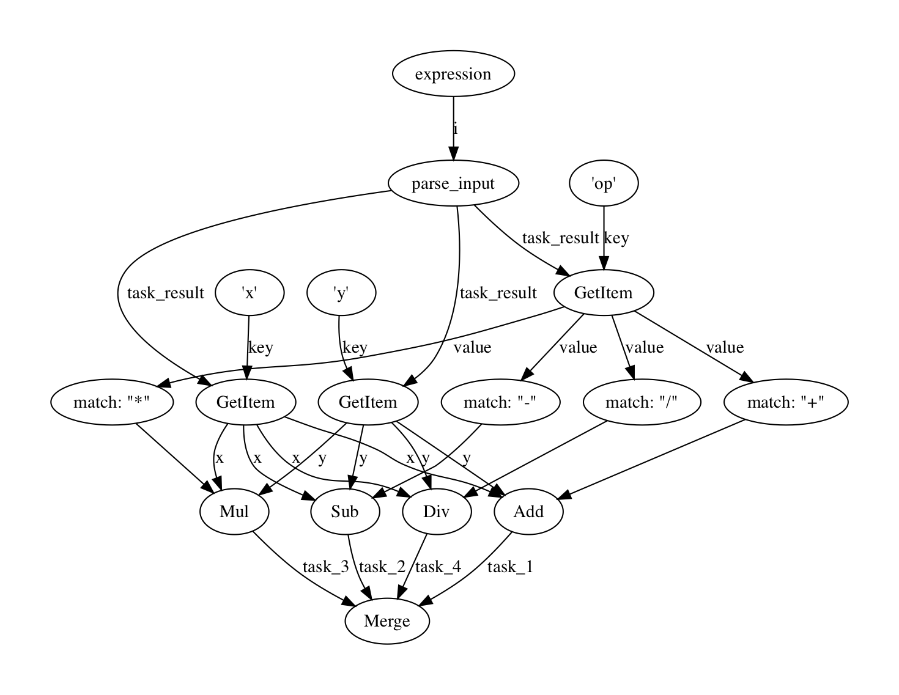

> 
> 你的数据工程框架能做这个吗？
> 

Prefect是一种重型数据工作流系统，但它也可以处理轻量级应用程序。

为了说明这一点，让我们构建一个算子。

## 设置

让我们编写一个轻量函数，使检索计算结果更加容易。我们要做的就是选择终结者task的值。你不需要这样做，但是由于在本教程中我们将要用几次，因此它将使示例更加清楚。

````Python
from prefect import task, Flow, Parameter

def run(flow, **parameters):
    state = flow.run(**parameters)
    terminal_task = list(flow.terminal_tasks())[0]
    return state.result[terminal_task].result
````

## 加一

有什么事情比对一个数字+1更容易？

````Python
with Flow('Add one') as flow:
    result = Parameter('x') + 1
````

Prefect参数跟其他task一样，除开它们从用户输入中获取值。

测试一下：

````Python
assert run(flow, x=1) == 2
assert run(flow, x=2) == 3
assert run(flow, x=-100) == -99
````

## 加两个数字

让我们提高一个层次，为什么需要两个输入却只有一个输入？

````Python
with Flow('Add x and y') as flow:
    result = Parameter('x') + Parameter('y')
````
>     
> **多参数**
> 
> flow可以具有任意数量的参数，只要它们具有唯一的名称即可。
> 

我们的新算子比较好用：

````Python
assert run(flow, x=1, y=1) == 2
assert run(flow, x=40, y=2) == 42
````

## 算术

一切都很好，但是让我们给用户一些选择。 我们可以将一个新的op参数与一个开关组合在一起，以使用户可以选择他们想要执行的算子，然后将结果合并为一个单个输出：

````Python
from prefect.tasks.control_flow import switch, merge

# note: this will raise some warnings, but they're ok for this use case!
with Flow('Arithmetic') as flow:
    x, y = Parameter('x'), Parameter('y')
    operations = {
        '+': x + y,
        '-': x - y,
        '*': x * y,
        '/': x / y
    }
    switch(condition=Parameter('op'), cases=operations)
    result = merge(*operations.values())
````

> 
> 条件分支
> 
> Prefect有几种有条件地运行task的方式，包括此处使用的switch和更简单的if/else。
> 
> 在此实例中，swich将检查op参数的值，然后执行与适当的计算相对应的task。merge函数用于将所有分支合并回单个结果。
> 

现在执行flow，我们提供需要的计算行为：

````Python
assert run(flow, x=1, op='+', y=2) == 3
assert run(flow, x=1, op='-', y=2) == -1
assert run(flow, x=1, op='*', y=2) == 2
assert run(flow, x=1, op='/', y=2) == 0.5
````

## 解析输入

我们的算术计算器可以工作，但是有点麻烦。让我们编写一个快速的自定义task，以获取一个字符串表达式并将其解析为x，y和op，其余代码与之前相同：

````Python
@task
def parse_input(expression):
    x, op, y = expression.split(' ')
    return dict(x=float(x), op=op, y=float(y))

with Flow('Arithmetic') as flow:
    inputs = parse_input(Parameter('expression'))

    # once we have our inputs, everything else is the same:
    x, y = inputs['x'], inputs['y']
    operations = {
        '+': x + y,
        '-': x - y,
        '*': x * y,
        '/': x / y
    }
    switch(condition=inputs['op'], cases=operations)
    result = merge(*operations.values())
````

> 
> **@task装饰器**
> 
> @task装饰器是将函数转换为task的最简单方式。
> 

如何检索task。

> 
> 索引task
> 
> 正如我们已经说明可以添加（或减去，或乘以或除以）task一样，也可以为task建立索引。 在这里，我们为输入task的结果建立索引以获取x，y和op。 像其他Prefect操作一样，索引本身也会记录在计算图中，但是将执行推迟到flow运行且索引结果实际可用为止。
> 

现在我们可以在字符串表达式🎉上运行计算器：

````Python
assert run(flow, expression='1 + 2') == 3
assert run(flow, expression='1 - 2') == -1
assert run(flow, expression='1 * 2') == 2
assert run(flow, expression='1 / 2') == 0.5
````

对于更进一步的探索，以下是自动跟踪和生成的计算图Prefect的可视化：

````Python
flow.visualize()
````



***

- [Prefect官网](https://www.prefect.io/)
- [英版原文](https://docs.prefect.io/core/advanced_tutorials/calculator.html)
- [联系译者](https://github.com/listen-lavender)


