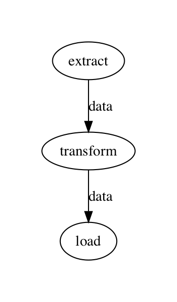

> 
> 数据工程的入门例子，就像"hello, world!"对于编程入门一样
> 

ETL（提取、转换、加载）是基本的数据工作流，但是在大多数数据工程框架中进行设置可能会是令人惊讶地复杂。

某些工具没有在task之间传递数据的简便方法，导致公司维护所有可能的来源和接收者组合的内部表示（S3_to_Redshift，S3_to_S3，Redshift_to_S3，Postgres_to_Redshift，Postgres_to_S3等）。其他框架具有灵活的来源和接收者，但缺乏编写完全可定制的转换的能力。

Prefect使ETL变得容易。

## 提取、转换、加载

开始定义三个函数，将用作我们的提取，转换和加载task。可以在这些函数中放入所需的任何内容，作为说明，我们将使用一个简单的数组。

为了唤醒Prefect机制，我们要做的就是将@task装饰器应用于函数。

> 
> **在task之间传递数据**
> 
> 不必担心在task之间传递大型数据对象。只要适合内存，Prefect都可以使用特殊设置进行处理。如果不是这样，则有多种方法可以在整个集群中分配操作。
> 

````Python
from prefect import task

@task
def extract():
    """Get a list of data"""
    return [1, 2, 3]

@task
def transform(data):
    """Multiply the input by 10"""
    return [i * 10 for i in data]

@task
def load(data):
    """Print the data to indicate it was received"""
    print("Here's your data: {}".format(data))
````

## flow

现在我们有了task，要创建一个flow并像调用函数一样调用task。在后台，Prefect正在生成一个计算图，该图跟踪我们task之间的所有依赖关系。

> 
> **延迟执行**
> 
> 看起来我们正在调用ETL函数，但实际上没有执行任何操作。在Prefect中，调用task是告诉框架与其他task的关系的便捷方法。Prefect使用该信息来构建计算图。在调用**flow.run()**之前，实际上什么也没有发生。
> 

````Python
from prefect import Flow

with Flow('ETL') as flow:
    e = extract()
    t = transform(e)
    l = load(t)

flow.run() # prints "Here's your data: [10, 20, 30]"
````

如果调用**flow.visualize()**，Prefect绘出计算图。



## 命令式flow

我们喜欢Prefect的函数式API，但有些用户可能喜欢更明确的方法。幸运的是，Prefect也可以通过命令式API进行操作。

这是使用命令式API构建的相同流程：

````Python
from prefect import Flow

flow = Flow('ETL')
flow.set_dependencies(transform, keyword_tasks=dict(data=extract))
flow.set_dependencies(load, keyword_tasks=dict(data=transform))

flow.run() # prints "Here's your data: [10, 20, 30]"
```` 

>     
> **混搭**
> 
> Prefect的函数式API和命令式API可以随时使用，即使脚本中的一行使用其他风格也可以使用。唯一的主要区别是函数式API要求代码在活动flow上下文中运行。
> 

***

- [Prefect官网](https://www.prefect.io/)
- [英版原文](https://docs.prefect.io/core/advanced_tutorials/etl.html)
- [联系译者](https://github.com/listen-lavender)
