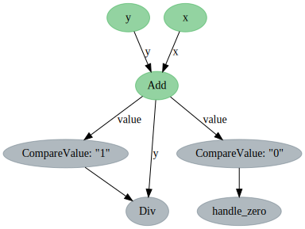

数据专业人员在试图理解数据集时首先要做的是将其可视化，这是一个普遍的口头禅。同样，在设计工作流时，最好以视觉方式检查创建的内容。

Prefect提供多种用于在本地构建、检查和测试flow的工具。在本教程中，我们将介绍一些可视化flow及其执行的方法。我们讨论的所有内容都将要求Prefect安装“viz”或“dev”附加组件：

````bash
pip install "prefect[dev]" # OR
pip install "prefect[viz]"
````
    
## 运行前的静态flow可视化

flow类带有内置的可视化方法，用于检查基础的有向无环图（DAG）。让我们设置一个基本示例：

````Python
from prefect import Flow, Parameter

with Flow("math") as f:
    x, y = Parameter("x"), Parameter("y")
    a = x + y

f.visualize()
```` 

> 
> 提示
> 
> Prefect task支持基本的python操作，例如加、减和比较。
> 


在这里，我们看到了基础流程图的一个很好的静态表示形式：节点对应于task（标有task名称），边对应于依赖关系（如传递数据则标有基础参数名称）。 这有助于理解task的依赖性，并可能在不执行task的情况下调整逻辑。

现在让我们创建一个更复杂的依赖链。

````Python
from prefect import task
from prefect.tasks.control_flow import switch

@task
def handle_zero():
    return float('nan')

with Flow("math") as f:
    x, y = Parameter("x"), Parameter("y")
    a = x + y
    switch(a, cases={0: handle_zero(),
                     1: 6 / a})

# if running in an Jupyter notebook, 
# visualize will render in-line, otherwise
# a new window will open
f.visualize()
````


通过此可视化，我们可以了解有关Prefect如何在后台运行的很多知识：

 - Prefect task的恒定输入（例如，上面的6个）不表示为task；相反，它们存储在flow对象的常量属性上；此属性包含一个词典，该词典将task所依赖的常量值与之关联
 - Prefect的一些实用工具task（例如上面的switch）在后台创建了多个task。在这种情况下，开关为我们提供的每种情况创建了一个新的CompareValue task
 - 一项task的每种类型的操作本身都由另一个task表示。上面我们可以看到除法操作导致了新的Div task。这突出了构建工作流时要记住的一个原则：所有运行时逻辑都应由task表示
 - 某些类型的task依赖是数据依赖（在可视化中以标记数据的边表示），而其他类型则代表纯状态依赖（在可视化中以未标记的边表示）

## 运行后的静态flow可视化

除了查看DAG的结构外，Prefect还允许轻松地可视化task的运行后状态。使用上面的flow，假设我们好奇如果设置x=1和y=2（开关未处理的条件）时状态将如何传播。在这种情况下，我们可以先执行流程，然后将所有task状态提供给**flow.visualize**方法以查看状态如何传播！

> 
> **状态颜色表示**
> 
> 所有状态的颜色及其继承关系可以在[状态的API参考文档](https://docs.prefect.io/api/latest/engine/state.html)中找到。
> 

````Python
flow_state = f.run(x=1, y=2)
f.visualize(flow_state=flow_state)
````
    


我们可以看到在这种情况下，switch的两个分支都被跳过了。

> 
> **实时更新可视化**
> 
> 所有可视化都是静态可视化，只能在运行完成之前或之后进行检查生成。有关实时更新视图，请在[Prefect Cloud UI](https://docs.prefect.io/orchestration/ui/flow-run.html#schematic)中找到标签。
> 

***

- [Prefect官网](https://www.prefect.io/)
- [英版原文](https://docs.prefect.io/core/advanced_tutorials/visualization.html)
- [联系译者](https://github.com/listen-lavender)

