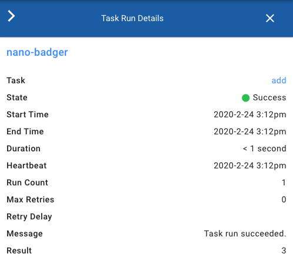

让我们看一下使用结果处理器。正如概念文档[结果和结果处理器](https://docs.prefect.io/core/concepts/results.html)中所介绍的那样，Prefect task将其返回值与附加task状态的Result对象相关联，并且可以使用ResultHandler对其进行扩展，启用后，结果处理器可以将结果序列化持久保存到任一存储后端。

为什么首先要使用结果处理器？一种常见的情况是允许在调试流程（包括尤其是生产流程）时检查中间数据。通过在不同的数据转换task期间检查数据，可以按照顺序分析检查点来跟踪运行时数据错误。

## 设置处理结果

必须调用结果处理器启用检查点。必须在以下两个位置启用：在全局范围为Prefect安装启用，并在task级别上提供结果处理器或flow/task初始化时参数覆盖。根据配置的结果处理器的不同，可能还需要确保正确设置身份验证秘钥。对于Prefect 0.9.1+上的Cloud用户，其中的一些默认情况下会处理。

对于Prefect版本<0.9.1的仅Core用户或Cloud用户，注意：

 - 通过将**prefect.config.flows.checkpointing**设置为True，全局选择加入Checkpoint
 - 至少为task的一个特定级别（flow级别或task级别）指定结果处理器

对于Prefect 0.9.1+版以上的Cloud用户：

 - 检查点将自动打开；可以通过向它的每个task传递**checkpoint=False**来关闭禁用它
 - 匹配**prefect.config.flows.storage**设置的存储后端的结果处理器将自动应用于所有task（如果有）；值得注意的是，Docker存储尚不支持此功能
 - 可以在全局级别、flow级别或task级别覆盖自动结果处理器

### flow级别设置结果处理器

````bash
export PREFECT__FLOWS__CHECKPOINTING=true
````

````Python
# flow.py
from prefect.engine.result_handlers import LocalResultHandler

@task
def add(x, y=1):
    return x + y

# send the configuration to the Flow object
with Flow("my handled flow!", result_handler=LocalResultHandler()):
    first_result = add(1, y=2)
    second_result = add(x=first_result, y=100)
````

### task级别设置结果处理器

````bash
export PREFECT__FLOWS__CHECKPOINTING=true
````

````Python
# flow.py
from prefect.engine.result_handlers import LocalResultHandler

# configure on the task decorator
@task(result_handler=LocalResultHandler())
def add(x, y=1):
    return x + y

class AddTask(Task):
        def run(self, x, y):
            return x + y

# or when instantiating a Task object
a = AddTask(result_handler=LocalResultHandler())

with Flow("my handled flow!"):
    first_result = add(1, y=2)
    second_result = add(x=first_result, y=100)
````
    
## 选择结果处理器

在以上示例中，我们仅使用了LocalResultHandler类。这是与不同存储后端集成的几种结果处理器之一。有关各种结果处理器完整列表，请参见[prefect.engine.results_handler的API文档](https://docs.prefect.io/api/latest/engine/result_handlers.html)，有关该使用接口的更多详细信息，请参见[结果和结果处理器文档](https://docs.prefect.io/core/concepts/results.html)。

我们可以编写自定义结果处理器，只要它们扩展ResultHandler规范即可；或者我们可以从Prefect Core中选择一个利用合适的存储后端的现有实现；例如，我将使用**prefect.engine.results_handler.GCSResultHandler**，以便将数据保留在Google Cloud Storage中。

## 在flow中使用GCSResultHandler

由于必须使用一些初始化参数来实例化GCSResultHandler对象，因此在配置它之后，我们传递flow级别Python对象来覆盖设置：

````Python
# flow.py
from prefect.engine.result_handlers import GCSResultHandler

gcs_handler = GCSResultHandler(bucket='prefect_results')

with Flow("my handled flow!", result_handler=gcs_handler):
    ...
````

确保Prefect安装可以通过Google的Cloud API进行身份验证。只要我的Prefect安装主机可以对此GCS空间进行身份验证，每个task的返回值都将在此GCS空间中序列化为自己的文件。

运行完flow后，当我在内存中检查它们时，可以看到task状态，知道它们各自的结果存储在**Result.safe_value**中的键名：

````bash
>>> state = flow.run()
>>> state.result[first_result]._result.safe_value
<SafeResult: '2020/2/24/21120e41-339f-4f7d-a209-82fb3b1b5507.prefect_result'>
>>> state.result[second_result]._result.safe_value
<SafeResult: '2020/2/24/133eaf17-ab77-4468-afdf-734b6540dde0.prefect_result'>
````

使用gsutil，我可以看到这些键存在于配置的结果处理器提交数据的目标GCS空间中：

````bash
$ gsutil ls -r gs://prefect_results
gs://prefect_results/2020/:

gs://prefect_results/2020/2/:

gs://prefect_results/2020/2/24/:
gs://prefect_results/2020/2/24/59082506-9217-436f-9d69-9ff569b20b7a.prefect_result
gs://prefect_results/2020/2/24/a07dd6c1-837d-4925-be46-3b525be57779.prefect_result
````

如果使用的是Prefect Cloud，则可以看到来自“safe value”的元数据也已存储并显示在UI中：


### 使用JSONResultHandler运行flow

JSONResultHandler是一种独特的情况，因为它会将整个Result对象序列化为其**Result.safe_value**。这仅对少量数据负载和Cloud用户轻松与Cloud数据库共享的数据有用。有效使用它们后，可以有效检查UI中的数据输出。因此，所有Prefect参数类型task都将其用作结果处理器。

让我们看一个例子。数字相加的相同flow将改为使用JSON结果处理器进行配置：

````Python
# flow.py
from prefect.engine.result_handlers import JSONResultHandler

with Flow("my handled flow!", result_handler=JSONResultHandler()):
    ...
````

现在，当我运行flow时，Result.safe_value包含其中的task的实际返回值：

````bash
>>> state.result[first_result]._result.value
3
>>> state.result[first_result]._result.safe_value
<SafeResult: '3'>
````

而且，在检查task运行详细信息时，此值3对UI中的Cloud用户也是可见的：



***

- [Prefect官网](https://www.prefect.io/)
- [英版原文](https://docs.prefect.io/core/advanced_tutorials/using-result-handlers.html)
- [联系译者](https://github.com/listen-lavender)
